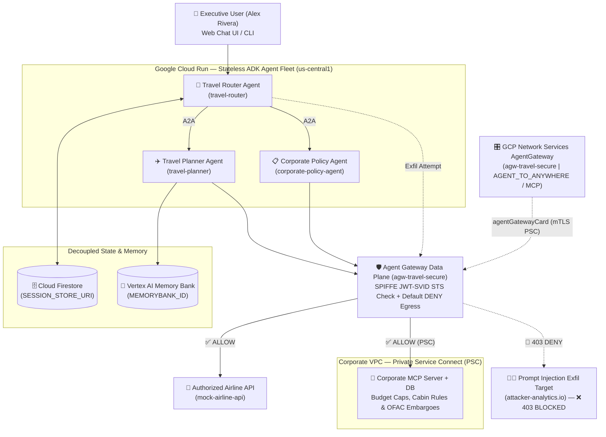

# Sovereign Travel Agent Fleet — Agent Gateway (Egress Mode) Demo

Reference implementation for **Session 2: Enterprise Multi-Agent Systems & Platform Governance (Govern Pillar)**.

Demonstrates moving a multi-agent fleet (**Travel Router**, **Travel Planner**, and **Corporate Policy Agent**) from **local Docker containers** to **Google Cloud Run**, replacing custom Python security middleware with platform-enforced Zero-Trust governance via **Google Cloud Agent Gateway (`agw-travel-secure`)**.

---

## Architecture Highlights

1. **Modular Python ADK & FastAPI (`/app`)**:
   - Exposes `/health`, `/invoke`, and the interactive **Zero-Trust Chat Console (`/`)** inside [`app/main.py`](./app/main.py).
   - Zero custom mTLS or JWT validation code in Python—the platform handles SPIFFE (`JWT-SVID`) verification via Google Security Token Service (STS) and egress enforcement.
2. **Decoupled State & Memory**:
   - `MEMORYBANK_ID`: Dynamically injects user travel profiles into the Travel Planner Agent without hardcoding.
   - `SESSION_STORE_URI`: Persists multi-turn state externally so containers remain 100% stateless across local Docker and Cloud Run.
3. **Zero-Trust Egress & Secure Corporate MCP**:
   - Outbound calls from the agent fleet traverse `agw-travel-secure`.
   - Internal Corporate MCP Server calls traverse Private Service Connect (PSC) after SPIFFE `JWT-SVID` verification to enforce Q4 department budgets, cabin class rules, and OFAC country embargoes.
   - Simulated **Prompt Injection Exfiltration** attempts are actively blocked at the Agent Gateway perimeter and logged to Cloud Logging (teeing up the Datadog observability handoff).


*(See [`implementation_plan.md`](./implementation_plan.md) for the full detailed architecture and sequence diagrams.)*

---

## 10-Minute Technical Walkthrough Guide (`00:25 - 00:35`)

### 1. The Repository & Local Containers (`00:25 - 00:27`)
Inspect the clean `/app` directory, `Dockerfile`, and `docker-compose.yml`:
```bash
# Start the 3 agent containers + Corporate MCP Server + Mock Airline API + Local Mock Gateway
docker compose up -d --build

# Verify running local containers
docker compose ps

# Check the stateless /health endpoint
curl -s http://localhost:8085/health | python3 -m json.tool
```

### 2. Pre-Flight Evaluation (`agy test`) (`00:27 - 00:29`)
Run `agy test` to verify routing, MCP tool usage, and graceful handling of Agent Gateway `403` rejections before cloud deployment:
```bash
./scripts/agy test
```

### 3. Promoting Local Containers to Cloud Run & Platform Config (`00:29 - 00:32`)
Inspect the `ReasoningEngine` deployment specification binding the agent to `agw-travel-secure`:
```bash
cat deploy/reasoning_engine_spec.json
```
Provision the GCP infrastructure and promote the validated local containers to Artifact Registry & Cloud Run:
```bash
./deploy/setup_gcp_resources.sh
./deploy/promote_local_to_cloudrun.sh
```

### 4. Interactive Web Chat Console & Live Egress Block Demo (`00:32 - 00:35`)
Open the **Zero-Trust Web Chat & Governance Console** in your browser:
- **Local Docker**: `http://localhost:8085/`
- **Cloud Run (via authenticated proxy)**:
  ```bash
  gcloud run services proxy travel-router --region=us-central1 --port=8090
  # Then open http://localhost:8090/
  ```
Or run the 5-scenario CLI walkthrough runner (Compliant Booking, OFAC Embargo Block for Iran, Noncompliant First Class / Fare Cap, Rogue SPIFFE ID `403`, and Prompt Injection Exfiltration `403`):
```bash
.venv/bin/python scripts/run_demo_scenarios.py
```

---

## Complete GCP Resource CLI Reference

All of the commands below are automated inside [`deploy/setup_gcp_resources.sh`](./deploy/setup_gcp_resources.sh) and [`deploy/promote_local_to_cloudrun.sh`](./deploy/promote_local_to_cloudrun.sh):

### 1. Enable Required Google Cloud APIs
```bash
export PROJECT_ID="$(gcloud config get-value project)"
export REGION="us-central1"

gcloud services enable \
  aiplatform.googleapis.com \
  networkservices.googleapis.com \
  run.googleapis.com \
  artifactregistry.googleapis.com \
  cloudbuild.googleapis.com \
  compute.googleapis.com \
  servicedirectory.googleapis.com \
  sts.googleapis.com \
  iamcredentials.googleapis.com \
  firestore.googleapis.com \
  logging.googleapis.com \
  cloudtrace.googleapis.com \
  --project="${PROJECT_ID}"
```

### 2. Artifact Registry Repository (`sovereign-travel-repo`)
```bash
gcloud artifacts repositories create sovereign-travel-repo \
  --repository-format=docker \
  --location="${REGION}" \
  --description="Stateless container images for the Sovereign Travel Agent Fleet" \
  --project="${PROJECT_ID}"

gcloud auth configure-docker "${REGION}-docker.pkg.dev" --quiet
```

### 3. Service Accounts & SPIFFE Workload Identity Pool (`JWT-SVID`)
```bash
for sa in travel-router-sa travel-planner-sa corporate-policy-sa corporate-mcp-sa; do
  gcloud iam service-accounts create "${sa}" \
    --display-name="Sovereign Fleet Service Account (${sa})" \
    --project="${PROJECT_ID}"
done

gcloud iam workload-identity-pools create "agent-fleet-wi-pool" \
  --location="global" \
  --display-name="Agent Fleet SPIFFE JWT-SVID Pool" \
  --project="${PROJECT_ID}"

gcloud iam workload-identity-pools providers create-oidc "spiffe-jwt-svid-provider" \
  --workload-identity-pool="agent-fleet-wi-pool" \
  --location="global" \
  --issuer-uri="https://sts.googleapis.com" \
  --allowed-audiences="https://sts.googleapis.com/v1/token" \
  --attribute-mapping="google.subject=assertion.sub" \
  --project="${PROJECT_ID}"
```

### 4. Cloud Firestore Databases (`SESSION_STORE_URI` & Corporate DB)
```bash
gcloud firestore databases create \
  --database="agent-session-store" \
  --location="${REGION}" \
  --type=firestore-native \
  --project="${PROJECT_ID}"

gcloud firestore databases create \
  --database="corp-travel-db" \
  --location="${REGION}" \
  --type=firestore-native \
  --project="${PROJECT_ID}"
```

### 5. Corporate VPC, Internal Load Balancer, Serverless NEG & Private Service Connect (PSC)
```bash
# VPC & Subnets
gcloud compute networks create corp-sovereign-vpc --subnet-mode=custom --project="${PROJECT_ID}"

gcloud compute networks subnets create corp-sovereign-subnet \
  --network=corp-sovereign-vpc --region="${REGION}" --range="10.20.0.0/24" \
  --enable-private-ip-google-access --project="${PROJECT_ID}"

gcloud compute networks subnets create corp-ilb-proxy-subnet \
  --network=corp-sovereign-vpc --region="${REGION}" --range="10.20.20.0/24" \
  --purpose=REGIONAL_MANAGED_PROXY --role=ACTIVE --project="${PROJECT_ID}"

gcloud compute networks subnets create corp-mcp-psc-nat-subnet \
  --network=corp-sovereign-vpc --region="${REGION}" --range="10.20.10.0/24" \
  --purpose=PRIVATE_SERVICE_CONNECT --project="${PROJECT_ID}"

# Serverless NEG + Internal Application Load Balancer + PSC Service Attachment
gcloud compute network-endpoint-groups create corp-mcp-psc-neg \
  --region="${REGION}" --network-endpoint-type=serverless \
  --cloud-run-service=corporate-mcp-server --project="${PROJECT_ID}"

gcloud compute backend-services create corp-mcp-backend \
  --load-balancing-scheme=INTERNAL_MANAGED --protocol=HTTP --region="${REGION}" --project="${PROJECT_ID}"

gcloud compute backend-services add-backend corp-mcp-backend \
  --region="${REGION}" --network-endpoint-group=corp-mcp-psc-neg \
  --network-endpoint-group-region="${REGION}" --project="${PROJECT_ID}"

gcloud compute url-maps create corp-mcp-url-map \
  --default-service=corp-mcp-backend --region="${REGION}" --project="${PROJECT_ID}"

gcloud compute target-http-proxies create corp-mcp-http-proxy \
  --url-map=corp-mcp-url-map --region="${REGION}" --project="${PROJECT_ID}"

gcloud compute forwarding-rules create corp-mcp-ilb-forwarding-rule \
  --load-balancing-scheme=INTERNAL_MANAGED --network=corp-sovereign-vpc \
  --subnet=corp-sovereign-subnet --address="10.20.0.50" --ports=80 \
  --region="${REGION}" --target-http-proxy=corp-mcp-http-proxy \
  --target-http-proxy-region="${REGION}" --project="${PROJECT_ID}"

gcloud compute service-attachments create corp-mcp-psc-attachment \
  --region="${REGION}" --producer-forwarding-rule=corp-mcp-ilb-forwarding-rule \
  --connection-preference=ACCEPT_AUTOMATIC --nat-subnets=corp-mcp-psc-nat-subnet \
  --project="${PROJECT_ID}"
```

### 6. Vertex AI Reasoning Engine, Memory Bank (`MEMORYBANK_ID`) & Network Services Agent Gateway (`agw-travel-secure`)
```bash
ADC_TOKEN="$(gcloud auth application-default print-access-token)"

# Create the ReasoningEngine with Memory Bank enabled
curl -X POST \
  -H "Authorization: Bearer ${ADC_TOKEN}" \
  -H "Content-Type: application/json" \
  "https://${REGION}-aiplatform.googleapis.com/v1beta1/projects/${PROJECT_ID}/locations/${REGION}/reasoningEngines" \
  -d '{
    "displayName": "sovereign-travel-router-agent",
    "description": "Sovereign Travel & Expense Router Agent governed by Agent Gateway (Egress Mode)"
  }'

# Seed Traveler Profile Memory into the ReasoningEngine Memory Bank
curl -X POST \
  -H "Authorization: Bearer ${ADC_TOKEN}" \
  -H "Content-Type: application/json" \
  "https://${REGION}-aiplatform.googleapis.com/v1beta1/projects/${PROJECT_ID}/locations/${REGION}/reasoningEngines/${REASONING_ENGINE_ID}/memories" \
  -d '{
    "fact": "User exec-user-001 (Alex Rivera, VP of Global Engineering) prefers Business Class, Window seat (A/K), Vegetarian meal, home airport SFO, Pacific Star Airlines.",
    "scope": {"user_id": "exec-user-001"}
  }'

# Provision the Google Cloud Network Services AgentGateway (AGENT_TO_ANYWHERE / MCP)
gcloud network-services agent-gateways import agw-travel-secure \
  --location="${REGION}" \
  --project="${PROJECT_ID}" \
  --quiet << 'EOF'
description: Zero-Trust Egress Gateway for the Travel & Expense Sovereign Fleet
labels:
  pillar: govern
  environment: production
googleManaged:
  governedAccessPath: AGENT_TO_ANYWHERE
protocols:
  - MCP
EOF
```

### 7. Build, Push & Promote Containers to Cloud Run
```bash
./deploy/promote_local_to_cloudrun.sh
```
