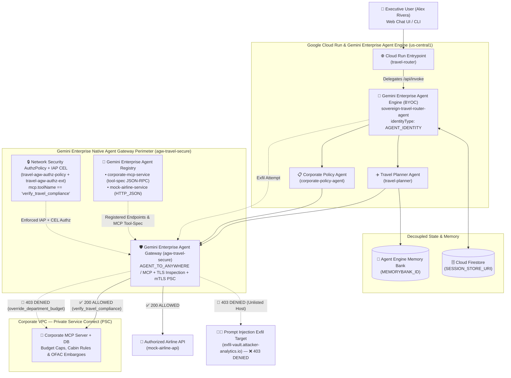

# Sovereign Travel Agent Fleet — Agent Gateway (Egress Mode) Demo

Reference implementation for **Session 2: Enterprise Multi-Agent Systems & Platform Governance (Govern Pillar)**.

Demonstrates moving a multi-agent fleet (**Travel Router**, **Travel Planner**, and **Corporate Policy Agent**) from **local Docker containers** to **Google Cloud Run** and **Gemini Enterprise Agent Engine (BYOC)**, replacing custom Python security middleware with platform-enforced Zero-Trust governance via **Gemini Enterprise Agent Gateway (`agw-travel-secure`)**.

---

## Architecture Highlights

1. **Modular Python ADK & FastAPI (`/app`)**:
   - Exposes `/health`, `/invoke`, `/api/reasoning_engine`, and the interactive **Zero-Trust Chat Console (`/`)** inside [`app/main.py`](./app/main.py).
   - Zero custom mTLS or JWT validation code in Python. In cloud production (`AGENT_GATEWAY_URL=native`), outbound HTTP and JSON-RPC 2.0 MCP traffic is intercepted directly by Google Cloud's native **Agent Gateway (`agw-travel-secure`)**.
2. **Decoupled State & Memory**:
   - `MEMORYBANK_ID`: Dynamically injects user travel profiles into the Travel Planner Agent from **Agent Engine Memory Bank** without hardcoding.
   - `SESSION_STORE_URI`: Persists multi-turn state externally in Cloud Firestore (`agent-session-store`) so containers remain 100% stateless across local Docker, Cloud Run, and **Gemini Enterprise Agent Engine**.
3. **Zero-Trust Egress, Agent Registry `tool-spec`, & IAP CEL Enforcement**:
   - The BYOC **Gemini Enterprise Agent Engine (`sovereign-travel-router-agent`)** runs with `identityType: AGENT_IDENTITY` and `deploymentSpec.agentGatewayConfig.agentToAnywhereConfig.agentGateway` bound to `agw-travel-secure` (with `agw-travel-secure`'s `rootCertificates` installed in [`Dockerfile`](./Dockerfile) via `update-ca-certificates`).
   - **Gemini Enterprise Agent Registry** registers `corporate-mcp-service` with [`deploy/mcp_toolspec.json`](./deploy/mcp_toolspec.json) (`--mcp-server-spec-type=tool-spec`, `protocolBinding=JSONRPC`) and `mock-airline-service` (`protocolBinding=HTTP_JSON`).
   - **Network Security `AuthzPolicy` (`travel-agw-authz-policy`) + `AuthzExtension` (`travel-agw-authz-ext` -> `iap.googleapis.com`, `failOpen: false`)** evaluates IAP `roles/iap.egressor` bindings and CEL conditions (`api.getAttribute('iap.googleapis.com/mcp.toolName', '') in ['verify_travel_compliance', '']`) in flight:
     - Authorized flight lookups and `verify_travel_compliance` MCP tool calls return `200 OK` (`authzPolicyInfo.result: "ALLOWED"`).
     - Unauthorized MCP tool calls (`override_department_budget` in Scenario 4) and prompt-injection exfiltration attempts (`https://exfil-vault.attacker-analytics.io/collect` in Scenario 5) are natively blocked at `agw-travel-secure` with HTTP `403 Forbidden` (`authzPolicyInfo.result: "DENIED"`) and logged to `networkservices.googleapis.com/Gateway`.


*(Note: Local Docker Compose and `./scripts/agy test` use `AGENT_GATEWAY_URL=http://mock-agent-gateway:8095` routed through the local proxy [`services/mock_gateway/proxy.py`](./services/mock_gateway/proxy.py), whereas Cloud deployments use `AGENT_GATEWAY_URL=native` governed directly by Google Cloud `AgentGateway`, `AgentRegistry`, and `AuthzPolicy`. See [`implementation_plan.md`](./implementation_plan.md) for the full detailed architecture and sequence diagrams.)*

---

## 10-Minute Technical Walkthrough Guide (`00:25 - 00:35`)

### 1. The Repository & Local Containers (`00:25 - 00:27`)
Inspect the clean `/app` directory, `Dockerfile`, and `docker-compose.yml`:
```bash
# Start the 3 agent containers + Corporate MCP Server + Mock Airline API + Local Mock Gateway
docker compose up -d --build

# Verify running local containers
docker compose ps

# Check the stateless /health endpoint
curl -s http://localhost:8085/health | python3 -m json.tool
```

### 2. Pre-Flight Evaluation (`agy test`) (`00:27 - 00:29`)
Run `agy test` to verify routing, MCP tool usage, and graceful handling of Agent Gateway `403` rejections before cloud deployment:
```bash
./scripts/agy test
```

### 3. Promoting Local Containers to Cloud Run & Agent Engine (`00:29 - 00:32`)
Inspect the Agent Engine deployment specification binding the agent container to `agw-travel-secure`:
```bash
cat deploy/reasoning_engine_spec.json
```
Provision the GCP infrastructure and promote the validated local containers to Artifact Registry, Cloud Run, and Gemini Enterprise Agent Engine:
```bash
./deploy/setup_gcp_resources.sh
./deploy/promote_local_to_cloudrun.sh
```

### 4. Interactive Web Chat Console & Live Egress Block Demo (`00:32 - 00:35`)
Open the **Zero-Trust Web Chat & Governance Console** in your browser:
- **Local Docker**: `http://localhost:8085/`
- **Cloud Run + Agent Engine (via authenticated proxy)**:
  ```bash
  gcloud run services proxy travel-router --region=us-central1 --port=8090
  # Then open http://localhost:8090/
  ```
Or run the 5-scenario CLI walkthrough runner (Compliant Booking, OFAC Embargo Block for Iran, Noncompliant First Class / Fare Cap, Unauthorized MCP Tool / Identity `403`, and Prompt Injection Exfiltration `403`):
```bash
# Against Local Docker:
.venv/bin/python scripts/run_demo_scenarios.py

# Against Live Cloud Run + Agent Engine + agw-travel-secure:
ROUTER_URL="$(gcloud run services describe travel-router --region=us-central1 --format='value(status.url)')"
TARGET_ROUTER_URL="${ROUTER_URL}" .venv/bin/python scripts/run_demo_scenarios.py
```

### 5. Native Cloud Logging Filter (`networkservices.googleapis.com/Gateway`)
To view the native `ALLOWED` (`200`) and `DENIED` (`403`) decisions emitted directly by Google Cloud's `agw-travel-secure` service in Cloud Logging (Logs Explorer):
```text
resource.type="networkservices.googleapis.com/Gateway"
resource.labels.gateway_name="agw-travel-secure"
httpRequest.requestMethod!="CONNECT"
NOT httpRequest.requestUrl:"googleapis.com"
```

---

## Complete GCP Resource CLI Reference

All of the commands below are automated inside [`deploy/setup_gcp_resources.sh`](./deploy/setup_gcp_resources.sh) and [`deploy/promote_local_to_cloudrun.sh`](./deploy/promote_local_to_cloudrun.sh):

### 1. Enable Required Google Cloud APIs
```bash
export PROJECT_ID="$(gcloud config get-value project)"
export REGION="us-central1"

gcloud services enable \
  aiplatform.googleapis.com \
  networkservices.googleapis.com \
  networksecurity.googleapis.com \
  agentregistry.googleapis.com \
  iap.googleapis.com \
  run.googleapis.com \
  artifactregistry.googleapis.com \
  cloudbuild.googleapis.com \
  compute.googleapis.com \
  servicedirectory.googleapis.com \
  sts.googleapis.com \
  iamcredentials.googleapis.com \
  firestore.googleapis.com \
  logging.googleapis.com \
  cloudtrace.googleapis.com \
  --project="${PROJECT_ID}"
```

### 2. Artifact Registry Repository (`sovereign-travel-repo`)
```bash
gcloud artifacts repositories create sovereign-travel-repo \
  --repository-format=docker \
  --location="${REGION}" \
  --description="Stateless container images for the Sovereign Travel Agent Fleet" \
  --project="${PROJECT_ID}"

gcloud auth configure-docker "${REGION}-docker.pkg.dev" --quiet
```

### 3. Service Accounts & SPIFFE Workload Identity Pool (`JWT-SVID`)
```bash
for sa in travel-router-sa travel-planner-sa corporate-policy-sa corporate-mcp-sa; do
  gcloud iam service-accounts create "${sa}" \
    --display-name="Sovereign Fleet Service Account (${sa})" \
    --project="${PROJECT_ID}"
done

gcloud iam workload-identity-pools create "agent-fleet-wi-pool" \
  --location="global" \
  --display-name="Agent Fleet SPIFFE JWT-SVID Pool" \
  --project="${PROJECT_ID}"
```

### 4. Cloud Firestore Databases (`SESSION_STORE_URI` & Corporate DB)
```bash
gcloud firestore databases create \
  --database="agent-session-store" \
  --location="${REGION}" \
  --type=firestore-native \
  --project="${PROJECT_ID}"

gcloud firestore databases create \
  --database="corp-travel-db" \
  --location="${REGION}" \
  --type=firestore-native \
  --project="${PROJECT_ID}"
```

### 5. Corporate VPC, Internal Load Balancer, Serverless NEG & Private Service Connect (PSC)
```bash
# VPC & Subnets
gcloud compute networks create corp-sovereign-vpc --subnet-mode=custom --project="${PROJECT_ID}"

gcloud compute networks subnets create corp-sovereign-subnet \
  --network=corp-sovereign-vpc --region="${REGION}" --range="10.20.0.0/24" \
  --enable-private-ip-google-access --project="${PROJECT_ID}"

gcloud compute networks subnets create corp-ilb-proxy-subnet \
  --network=corp-sovereign-vpc --region="${REGION}" --range="10.20.20.0/24" \
  --purpose=REGIONAL_MANAGED_PROXY --role=ACTIVE --project="${PROJECT_ID}"

gcloud compute networks subnets create corp-mcp-psc-nat-subnet \
  --network=corp-sovereign-vpc --region="${REGION}" --range="10.20.10.0/24" \
  --purpose=PRIVATE_SERVICE_CONNECT --project="${PROJECT_ID}"

# Serverless NEG + Internal Application Load Balancer + PSC Service Attachment
gcloud compute network-endpoint-groups create corp-mcp-psc-neg \
  --region="${REGION}" --network-endpoint-type=serverless \
  --cloud-run-service=corporate-mcp-server --project="${PROJECT_ID}"

gcloud compute backend-services create corp-mcp-backend \
  --load-balancing-scheme=INTERNAL_MANAGED --protocol=HTTP --region="${REGION}" --project="${PROJECT_ID}"

gcloud compute backend-services add-backend corp-mcp-backend \
  --region="${REGION}" --network-endpoint-group=corp-mcp-psc-neg \
  --network-endpoint-group-region="${REGION}" --project="${PROJECT_ID}"

gcloud compute url-maps create corp-mcp-url-map \
  --default-service=corp-mcp-backend --region="${REGION}" --project="${PROJECT_ID}"

gcloud compute target-http-proxies create corp-mcp-http-proxy \
  --url-map=corp-mcp-url-map --region="${REGION}" --project="${PROJECT_ID}"

gcloud compute forwarding-rules create corp-mcp-ilb-forwarding-rule \
  --load-balancing-scheme=INTERNAL_MANAGED --network=corp-sovereign-vpc \
  --subnet=corp-sovereign-subnet --address="10.20.0.50" --ports=80 \
  --region="${REGION}" --target-http-proxy=corp-mcp-http-proxy \
  --target-http-proxy-region="${REGION}" --project="${PROJECT_ID}"

gcloud compute service-attachments create corp-mcp-psc-attachment \
  --region="${REGION}" --producer-forwarding-rule=corp-mcp-ilb-forwarding-rule \
  --connection-preference=ACCEPT_AUTOMATIC --nat-subnets=corp-mcp-psc-nat-subnet \
  --project="${PROJECT_ID}"

gcloud compute network-attachments create corp-agw-net-attachment \
  --region="${REGION}" --connection-preference=ACCEPT_AUTOMATIC \
  --subnets=corp-sovereign-subnet --project="${PROJECT_ID}"
```

### 6. Network Services Agent Gateway (`agw-travel-secure`), `AuthzExtension`, & `AuthzPolicy`
```bash
PROJECT_NUMBER="$(gcloud projects describe "${PROJECT_ID}" --format='value(projectNumber)')"

# Provision the Google Cloud Network Services AgentGateway (AGENT_TO_ANYWHERE / MCP)
gcloud beta network-services agent-gateways import agw-travel-secure \
  --location="${REGION}" \
  --project="${PROJECT_ID}" \
  --quiet << EOF
description: Zero-Trust Egress Gateway for the Travel & Expense Sovereign Fleet
labels:
  pillar: govern
  environment: production
googleManaged:
  governedAccessPath: AGENT_TO_ANYWHERE
protocols:
  - MCP
registries:
  - //agentregistry.googleapis.com/projects/${PROJECT_ID}/locations/${REGION}
networkConfig:
  egress:
    networkAttachment: projects/${PROJECT_ID}/regions/${REGION}/networkAttachments/corp-agw-net-attachment
EOF

# Enforced IAP AuthzExtension & AuthzPolicy
gcloud beta service-extensions authz-extensions import travel-agw-authz-ext \
  --project="${PROJECT_ID}" \
  --location="${REGION}" \
  --quiet << 'EOF'
name: travel-agw-authz-ext
service: iap.googleapis.com
failOpen: false
timeout: 1s
metadata:
  iapPolicyVersion: "V1"
EOF

gcloud network-security authz-policies import travel-agw-authz-policy \
  --project="${PROJECT_ID}" \
  --location="${REGION}" \
  --quiet << EOF
name: projects/${PROJECT_ID}/locations/${REGION}/authzPolicies/travel-agw-authz-policy
target:
  resources:
    - projects/${PROJECT_NUMBER}/locations/${REGION}/agentGateways/agw-travel-secure
policyProfile: REQUEST_AUTHZ
action: CUSTOM
customProvider:
  authzExtension:
    resources:
      - projects/${PROJECT_NUMBER}/locations/${REGION}/authzExtensions/travel-agw-authz-ext
EOF
```

### 7. Build, Push & Promote Containers to Cloud Run + Agent Registry
```bash
./deploy/promote_local_to_cloudrun.sh
```
